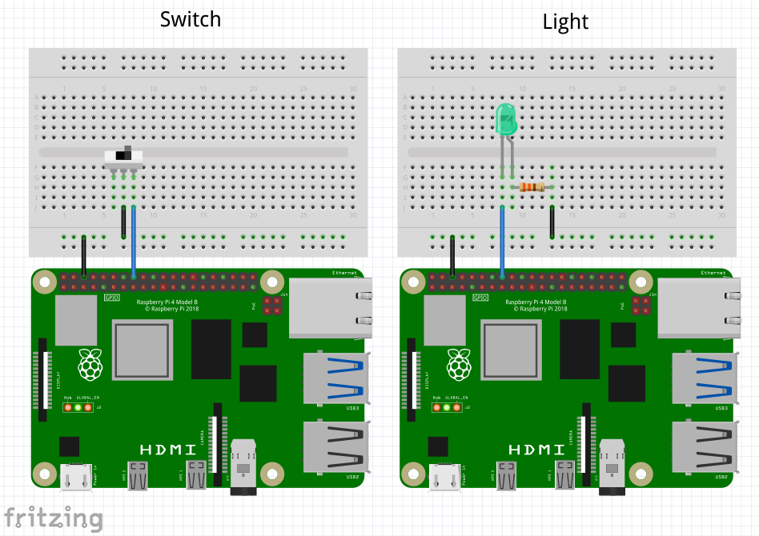

# The Switch and The Light



This example consists of an IoT system containing 2 components: a switch, and a light, both controller by a Raspberry
Pi 4.

* A Switch Service reads the state of the GPIO4 pin, and conveys it to the Arete control plane as a "desired state".
* A Light Service reads the desired state from the Arete control plane, and tries to realize it as "actual state"
  by setting a GPIO pin on or off.

## Building

```shell
$ npm install
```

## Running

### Run the switch service

The switch service needs to run as root in order to access GPIO edge triggers.

```shell
$ sudo node switch.js 
Switch service started
Switch is initially ON
Switch is now OFF
Switch is now ON
...
```

### Run the light service

```shell
$ sudo node light.js 
Light service started
Light is initially ON
Light is now OFF
Light is now ON
...
```

## What if my Raspberry Pi is not a 4B?

You'll find this line in `switch.js`:

```javascript
const GPIO04 = 516;
```

And this line in `light.js`:

```javascript
const GPIO23 = 535;
```

If you're not running on a Raspberry Pi 4B, then 516 and 535 will be the wrong values for you. Look up the correct
values with:

```shell
$ cat /sys/kernel/debug/gpio
gpiochip0: GPIOs 512-569, parent: platform/fe200000.gpio, pinctrl-bcm2711:
...
 gpio-516 (GPIO4               )
...
 gpio-535 (GPIO23              )
```
