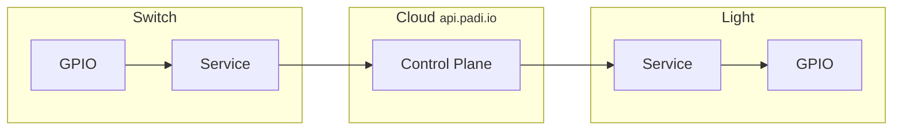

# The Switch and The Light


This example consists of an IoT system containing 2 components: a switch, and a light, each controlled by their own
Raspberry Pi 4B.

* A Switch Service reads the state of the GPIO4 pin, and conveys it to the Arete control plane as "desired state".
* A Light Service reads the desired state from the Arete control plane, and tries to realize it as "actual state"
  by setting a GPIO pin.



## Development Environment

Install Raspberry Pi OS (64-bit), the port of Debian Bookworm with Raspberry Pi Desktop, using
[Raspberry Pi Imager](https://www.raspberrypi.com/software/). Then install Rust the usual way:

```shell
$ curl --proto '=https' --tlsv1.2 -sSf https://sh.rustup.rs | sh
```

## Building

```shell
$ cargo build --examples
```

## Running

### Run the switch service

The switch service needs to run as root in order to access GPIO edge triggers.

```shell
$ sudo target/debug/examples/01-switch 
Connected to Arete control plane
Switch is initially ON
Switch service started
Switch is now OFF
Switch is now ON
...
```

### Run the light service

TODO

## What if my Raspberry Pi is not a 4B?

You'll find this line in `switch.js`:

```javascript
const GPIO04 = 516;
```

And this line in `light.js`:

```javascript
const GPIO23 = 535;
```

If you're not running on a Raspberry Pi 4B, then 516 and 535 will be the wrong values for you. Look up the correct
values with:

```shell
$ cat /sys/kernel/debug/gpio
gpiochip0: GPIOs 512-569, parent: platform/fe200000.gpio, pinctrl-bcm2711:
...
 gpio-516 (GPIO4               )
...
 gpio-535 (GPIO23              )
```
