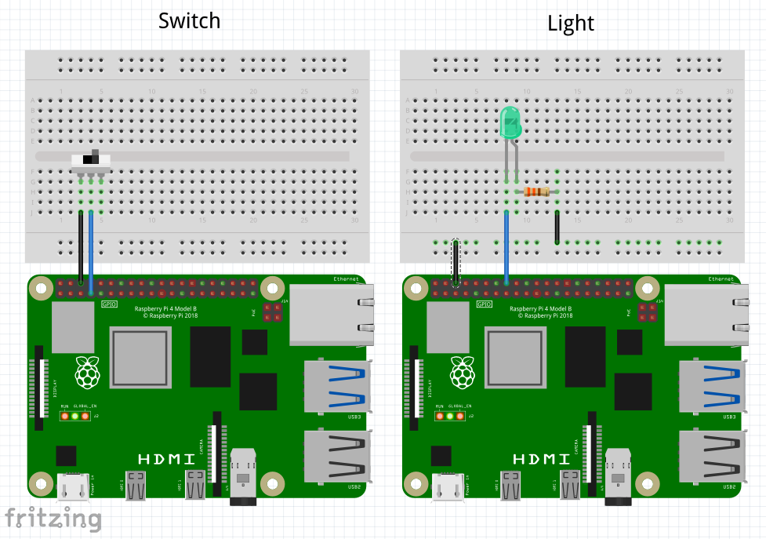
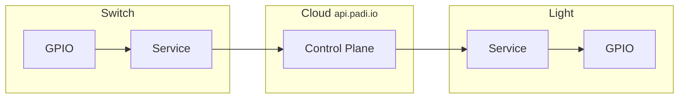

# The Switch and The Light



This example consists of an IoT system containing 2 components: a switch, and a light, each controlled by their own
Raspberry Pi 4B.

* A Switch Service reads the state of the GPIO 4 pin, and conveys it to the Arete control plane as "desired state".
* A Light Service reads the desired state from the Arete control plane, and tries to realize it as "actual state"
  by setting a GPIO 23 pin.



## Development Environment

Install Raspberry Pi OS (64-bit), the port of Debian Bookworm with Raspberry Pi Desktop, using
[Raspberry Pi Imager](https://www.raspberrypi.com/software/). Then install Rust the usual way:

```shell
$ curl --proto '=https' --tlsv1.2 -sSf https://sh.rustup.rs | sh
```

## Building

```shell
$ cargo build --examples
```

## Running

### Run the switch service

The switch service needs to run as root in order to access GPIO edge triggers.

```shell
$ sudo target/debug/examples/01-switch 
Connected to Arete control plane
Switch is initially ON
Switch service started
Switch is now OFF
Switch is now ON
...
```

### Run the light service

```shell
$ cargo run --example 01-light
Connected to Arete control plane
Registered as node onqXVczGoymQkFc3UN6qcM
Light is initially ON
Light service started
Light is now OFF
Light is now ON
```
